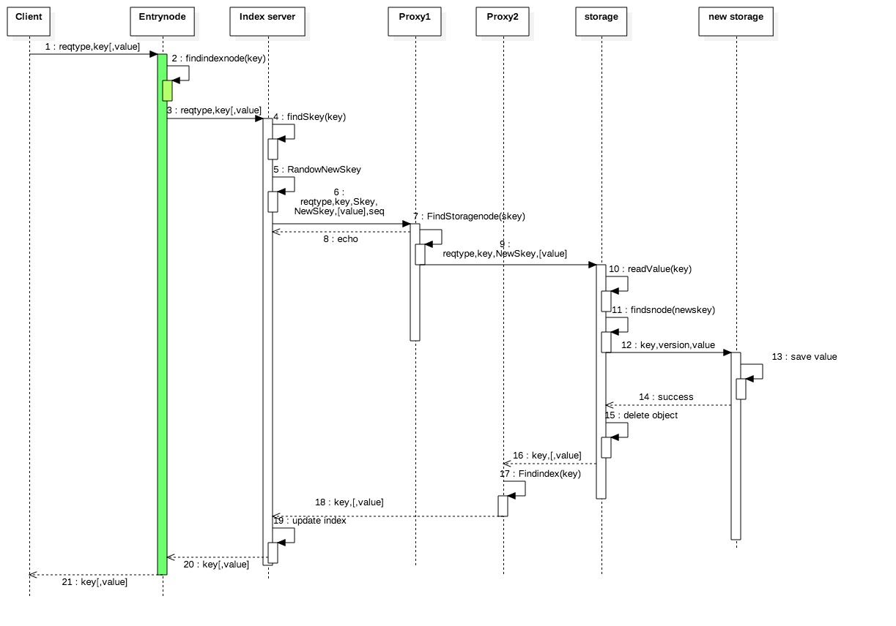
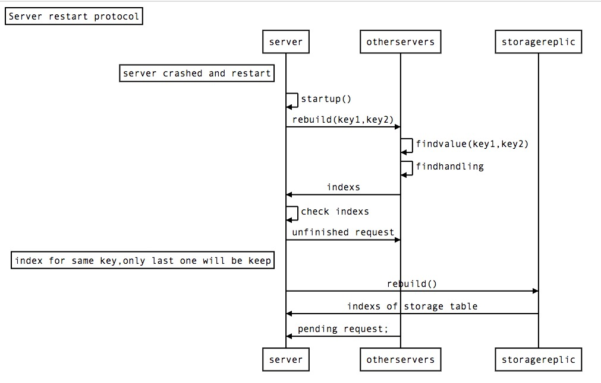

## Implementation

###Seq of opeartion
####Access 的过程

图中所有的连接都是通过ssl的
假设该请求的object仅有一个chunk
每个请求都被padding到同一长度
一共有五个数据结构：
a. index dht 用来寻找object key和其index server的dht
b. storage dht 用来寻找storage当前存放位置的dht
c. index table 用来查找有哪些key由这个机器负责保存storage key
d. storage table 用来查找当前实际存储了哪些object。
e. handing request table 用来表示当前机器有哪些请求正在等待返回。

access protocol：
1. client发送一个请求
2. entrynode收到请求后，在index table中找到该object对应的机器ip，并将
3. 该请求转发给index
4. Index 收到请求之后，在index table中找到object目前对应的storage key 记为skey。
5. Index 随机生成一个新的storage key，记为newskey
6. index将请求，skey，newskey以及一个数据的version，随机发送给三个proxy
7. proxy收到请求后，在storage dht中找到skey对应第seq个机器的ip。
8. proxy向index返回一个echo，表示已经收到该转发请求。echo应该有nonce，放reply攻击。
9. proxy向该ip，也就是storage node转发请求
10. storage 向proxy发送echo，表示自己受到请求。proxy收到storage 的echo后，在handling request table中删除这个请求。
11. storage收到请求后，readvalue从磁盘中读出数据和其version，如果是get请求，将读出的value代替之前的dummy value
12. storage 在storage dht中找到newskey对应自己的机器
13. storage node将key，value和version给newstorage
14. newstorage 将value和version存在磁盘中，将key和version存在storagetable中。
15. newstorage向storage返回success
16. storage删除这个object，并且在storagetable中删除对应条目。
17. storage 随机找个proxy，将key，value（请求结果转发）
18. proxy将请求发回给index server。
19. 当index server收到三个请求的返回（消息18）时，update index table，同时在handling request table中删除该请求。
20. index Server：如果index 收到了3个消息8，也即是有三个proxy都返回了echo，那么index Server在受到一个消息18之后立刻发送消息20.
21. entrynode将消息返回给client

为了保证协议的安全性，做出如下规定：
1. 在协议的任一阶段，当有机器不可达，source 机器需要反复尝试时，此时不应该再直接连接，而应该采用随机选择一个proxy。
//FIXME 待证明
整个access 协议最后的结果是集群中：
每个机器的出流量都是去往随机的机器
每个机器的入流量都是来自随机的机器

恢复协议：
机器重启之后，需要恢复两个table：index table和storage table。
首先说index table的恢复：

当一个enclave重启之后，像集群中所有的机器发送rebuild请求。在收到rebuild请求之后，otherserver扫描自己的storage table，找到该机器负责的key，将key，storage key发送给index server。

为了防止有未完成的请求导致的inconsist，每个机器需要检查自己的handling request table，发现有属于这个机器的key，则将该handling request的key，version，和newskey发送给该机器。
如果一个index server在crash时依然有请求在handling request table中，那么分为三种情况：
该请求未给client 返回success：client 将会timeout，并且稍后重新查询该请求是否执行成功。
该请求已经返回给client：此时一定有三个proxy 已经收到index server的转发请求并且在反复尝试。则攻击者依然需要crash3台机器，才能使该请求rollback。

在恢复storage table时，该机器首先向replic 发出请求，replic将其storage table返回。而后该server向所有的server 发出rebuild请求，otherservers检查自己的index table，将对应的skey的index 返回给server。

这样做会让集群中机器crash之后有个瞬时峰值。但是因为传递的都是index，所以数据量并不会特别大。

rebalance 协议：
当一台机器crash之后，或者有新的机器需要加入时，方法和恢复协议类似

### Oblivious batch shuffle algroithm
The attack can

### Oblivious

####Timer problem.
