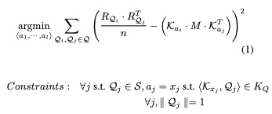

Access pattern disclosure on Searchable Encryption: Ramification, Attack and Mitigation.

这篇论文中提到，现在有很多的searchable encryption scheme，但是他们都没有考量access pattern的影响，因此可能导致不安全。这篇论文的主要工作包括衡量了access pattern 泄漏对于searchable encryption scheme的影响，提出了一个攻击模型，并且给出了一个攻击效率的样例。同时作者发现给出简单的混淆，就可以拥有很好地防御效果。

cloud computing 越来越多，将数据存储在远端可以很好的降低管理成本。敏感的数据需要加密存储在远端，但是想要在加密的存储上进行搜索有一定的困难。因此出现了很多的searchable encryption scheme（记做SES)。大部分的SES都会泄漏access pattern。尽管oblivious ram 可以隐藏access pattern，但是oRAM的性能开销太大，不能scale 到large dataset的缺点。

Searchable Encryption Scheme 通常有一些client 和一个untrusted server，client Alice有一些sensitive documents存储在untrusted server Bob那里。Alice不希望Bob知道Doc的内容，所以文档是加密存储的。为了能够搜索这些文档，有一份文档的index 存储在server上。这份index也是加密的。一个授权用户通过trapdoor 函数对搜索的keyword 进行加密，发送给 server ，server使用这个trapdoor 的函数搜索index。trapdoor函数是泛指单方面计算很容易，反过来计算很难的，例如RSA中的大数分解。攻击者无法得到trapdoor函数。同时隐藏具体的搜索对应的keyword是很重要的。一个searchable Encryption is secure，保证以下两点：

1\. Query generation function（trapdoor）只有授权可信用户知道。

2\. Search mechanism 只有在有效的query 才work 

以上是大部分的SES的基本原理，这篇论文不基于任何的具体的SES算法，而是提出通用的模型。通常Alice 发送一系列的query给Bob，bob返回对应的文档。那么New York Yankees 和 New York 相比，New York 出现的频率更高，因此攻击者可以大概推出哪些文档中有Yankees。基于这个观察，攻击者认为这个SES可能被攻破。

作者给出一个SES的的简化模型，以公式 的形式给出。

Alice有一系列的keyword 和document，首先Alice在本地构建一个modified Inverted Matrix。 也就是Index MAP（ID)。ID的行是文档，列是关键字， ID 中的第（i,j) 意思是第j个文档中有没有出现 第i个关键词。ID中的每一行都是独立加密的。Alice将这个加密的row 和对应的关键字的trapdoor产生的值发送给Bob的服务器。当Alice想要搜索某个关键字时，发送对应的关键字的trapdoor 的值给Bob，Bob进行简单的文字匹配，将匹配上的row 中对应的关键字为1 的row 发回给Alice。Alice解密这个row，并且请求对应的文档。

在这篇论文中，作者不关心背后的加密算法，也不关心中间的通信过程。只是观察到一个Alice发给Bob一个query，Bob最终返回给Alice一系列文档。

formal 的描述：

keyword：假设一共有m个keyword。每个keyword是一个向量，向量的长度为m，第i个keyword的向量的第i位为1，其余为0.

Query： 假设Alice发给bob一系列的Query，记为Q=  其中Qi= Trapdoor (Kj)

Response: Bob依据Q 发回给Alice一系列的Doc，记为R。某个Q对应的Respose 记为Rq=。在Rq中，第i位为1，当且仅当第i个文档被返回。换个说法就是：di = 0 if Kj 不在Doc i 中出现； di = 1 if Kj在Doc i中出现。

有了这个简单的模型，作者假设攻击者可以获得部分的Q和对应的Keyword的关系，同时作者假设攻击者可以获得一个和Alice非常类似的Index Map，基于这个信息，作者提出一个简化的攻击模型：

假设攻击者知道一部分的Q记为S，现在攻击者的目标是将其他的未知的query对应的keyword 猜出来。记为\<a1,… al\>. Mallory认为对于任意的j，都有Qj = Trapdoor(Kaj);

用下图的公式计算，其中第一行 RQi·RQj /n 可以得出两个keyword之间返回的文件有多相似（如果两个query 返回的

等式右边是Kai·M·Kaj 的意思是看两个keyword 有多相似，这是基于攻击者的背景信息 Index Map得出的。 减号左边是返回的文档多类似，减号右边是Index Map中两个keyword 多类似。因此如果减号结果为0，那么Kai 和Kaj肯定是对应的RQi和RQj的keyword。所以攻击者选取一系列的keyword，能够使得这个式子最小，则猜到了query的keyword。

为了防御这种攻击方式，作者提出将Index Map分partition，每个partition中的keyword的差距要足够小，因此对某些keyword 对应的Index Map插入fake的 bit。例如keyword 本来对应doc1 2 ，将doc4也设置为1，以此混淆。

阅读这篇论文给我的启发：

1\. 如何formal 的描述一个系统，并且构建数学模型说明其安全性。

2\. 这篇论文中提到，oblivious storage 需要大量的计算，不能scale 到large data set，因此不能使用。我们也许能hold 一样的opinion。